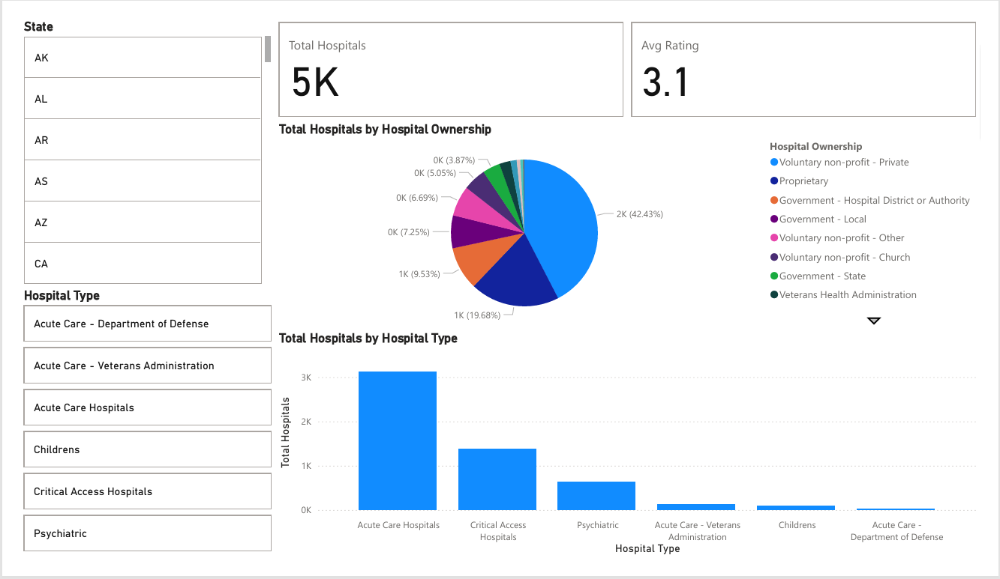
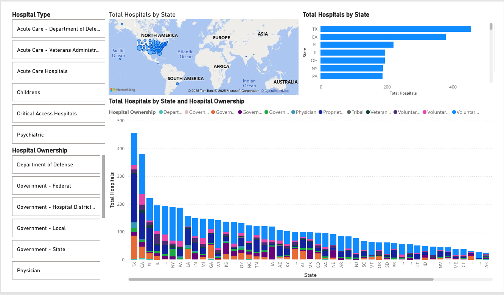
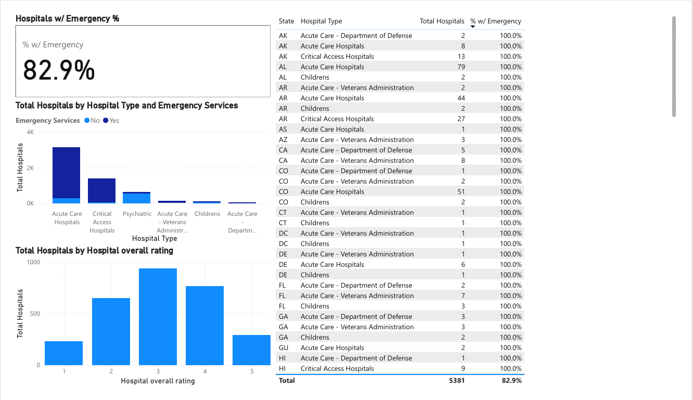

# 🏥 Hospital Supply Chain Dashboard

This Power BI dashboard analyzes U.S. hospital data (CMS) to provide insight into capacity, readiness, and regional coverage.

## 📊 Features
- **Overview Page**: Total hospitals, average rating, ownership breakdown, hospital types.
- **Regional Analysis**: State-by-state counts, slicers, and comparisons of facility distribution.
- **Readiness Metrics**: Emergency service availability and quality measures.
- **Interactive Filters**: Drill down by state, type, and ownership.

## 📷 Dashboard Previews
### Overview

### Regional Analysis

### Readiness

---

📂 Dataset: [CMS Hospital General Information](https://data.cms.gov/provider-data/dataset/xubh-q36u)  
📌 Built in **Power BI Desktop** | Author: *Sage Cain*
